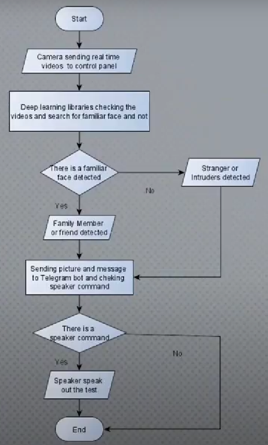
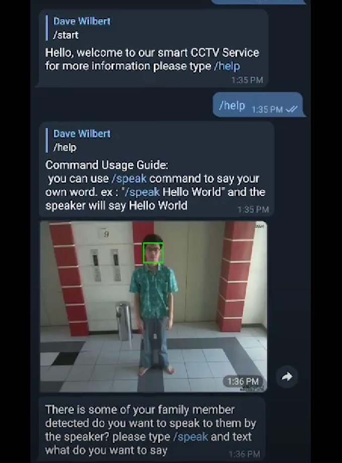
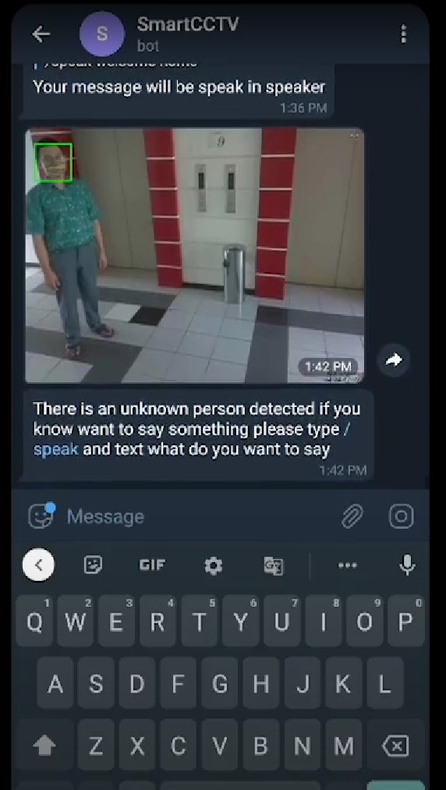
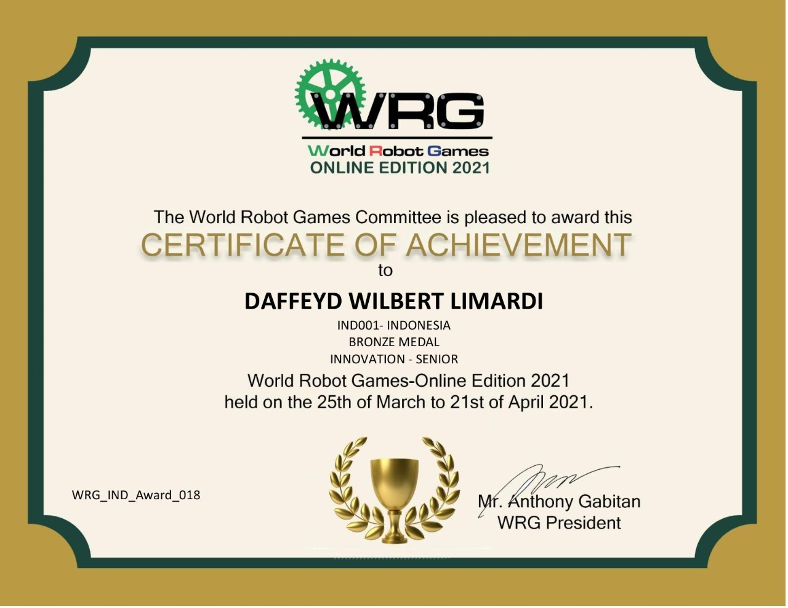

# Smart CCTV
This project help you to make sure your house is secure, it help you recognize familiar face and unfamiliar face, and send report to the owner of the system by telegram bot

The prototype of this project only IP Camera so there is no documentation for it

---

### Table of Contents


- [Description](#description)
- [How it Works](#how-it's-works)
- [Documentation](#documentation)
- [Author Info](#author-info)

---

## Description

This project is using IP Camera that sending picture to the main computer, the computer will analyze the picture and send the result to the owner, the owner also can send a message to the quest using the chat feature in telegram bot, the chat will be delivered to the quest that detected by the camera via speaker.

Flow Chart :




- Deep Learning
- MySQL Databases
- Raspberry Pi

Example familiar face report:



Example unfamiliar face report:



[Back To The Top](#smart-cctv)

---

##How it's works
---
1. First install library that we need
````
pip install opencv-python   
pip install numpy
pip install face-recognition
pip install pyttsx3 
pip install telepot
````
2. Capture the face that you want to recognize 
````
import cv2

cap = cv2.VideoCapture(0)

while True:
    _, frame = cap.read()
    cv2.imshow('take a picture ',frame)
    if cv2.waitKey(1) & 0xFF == ord('y') :
        cv2.imwrite('my_picture.jpg', frame)
        break

cap.release()
cv2.destroyAllWindows()
````
3. Connect the program to your webcam 
````
import cv2
import numpy as np

cap = cv2.VideoCapture(0)
while True:
    _, frame = cap.read()
    cv2.imshow('just face', frame)
        if cv2.waitKey(1) & 0xFF == ord('q'):
            break

cap.release()
cv2.destroyAllWindows()
`````
4. Load the image that you want to recognize 
````
etcodetech_image = face_recognition.load_image_file("etcodetech.jpg")
etcodetech_face_encoding = face_recognition.face_encodings(etcodetech_image)[0]

known_face_encoding = [
    etcodetech_face_encoding
]
known_face_names = [
    "etcodetech"
]
````
5. Download the model of face and load to the program
````
faceDetect = cv2.CascadeClassifier('haarcascade_frontalface_default.xml')
````
6. For identification the picture or video change into gray 
````
while True:
    _, frame = cap.read()
    gray = cv2.cvtColor(frame, cv2.COLOR_BGR2GRAY)
    faces = faceDetect.detectMultiScale(gray, 1.3,5)
````
7. Change BGR to RGB
````
 rgb = cv2.cvtColor(frame, cv2.COLOR_BGR2RGB)
    encodings = face_recognition.face_encodings(rgb)
    names = []
````
8. Compare the known face and unknown face
````
for encoding in encodings:
        matches = face_recognition.compare_faces(known_face_encoding,
        encoding)
        name = "Unknown"

        if True in matches:
            matchedIdxs = [i for (i, b) in enumerate(matches) if b]
            counts = {}
            for i in matchedIdxs:
                best_match_index = np.argmin(matches)
                name = known_face_names[best_match_index]
                counts[name] = counts.get(name, 0) + 1
            name = max(counts, key=counts.get)
        names.append(name)
````

9. Put the text (name) and rectangle to the picture or video
````
for ((x, y, w, h), name) in zip(faces, names):
    cv2.rectangle(frame, (x, y), (x + w, y + h), (0, 255, 0), 2)
    cv2.putText(frame, name, (x, y), cv2.FONT_HERSHEY_SIMPLEX,
    0.75, (0, 255, 0), 2)`
````
10. Connect the program to the speaker
````
engine = pyttsx3.init() 
if matches [0] == True:
    engine.say("Wellcome home etcodetech") 
else:
    engine.say("Who are you ? i don't know you")
    engine.say("Please go back later")
engine.runAndWait()   
````
11. Capture the picture and send to the bot telegram
````
bot = telepot.Bot('insert your token')
if matches [0] == True:
    engine.say("Wellcome home etcodetech") 
    cv2.imwrite("family.jpg", frame)
    bot.sendPhoto('insert your chat id', photo=open('family.jpg', 'rb'))
else:
    engine.say("Who are you ? i don't know you")
    engine.say("Please go back later")
    cv2.imwrite("guest.jpg", frame)
    bot.sendPhoto('insert your chat id', photo=open('guest.jpg', 'rb'))
engine.runAndWait()       
````
---
## Documentation

[Demo Video](https://drive.google.com/file/d/12Cehx8K_zsW0g1DQV1q4izjjMHyKGQyY/view?usp=sharing)

This is the project got the second runner-up in [World Robot Games 2020 Online Edition](https://www.facebook.com/worldrobotgames)
The result at [closing ceremony](https://www.facebook.com/worldrobotgames/videos/1964450920384056/) video at 25:35.



[Back To The Top](#smart-cctv)

---
## Author Info

- Instagram - [daffeydwilbert](https://www.instagram.com/daffeydwilbert/)
- Email - daffeydwilbert@gmail.com

[Back To The Top](#smart-cctv)

